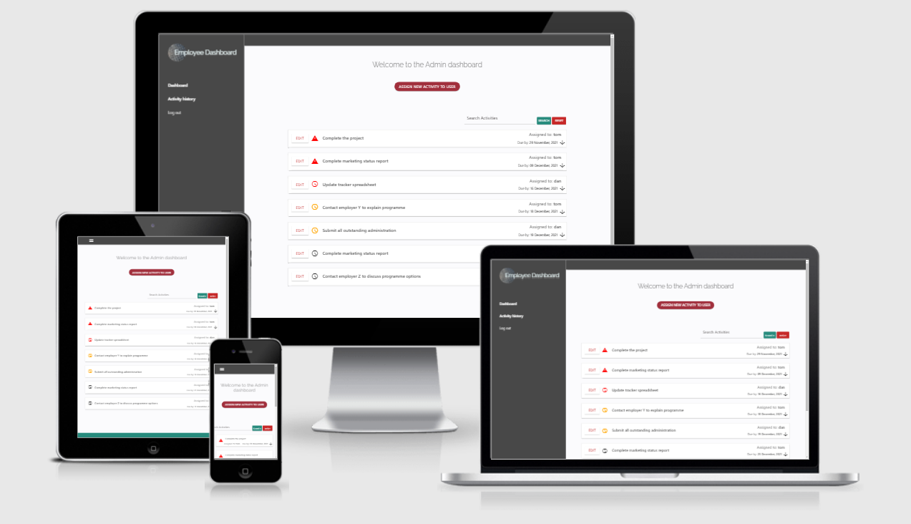
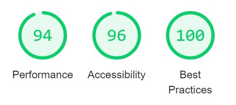

URL to the current deployed application:  [Employee Dashboard App](http://staff-dashboard.herokuapp.com/)

# Employee Dashboard Application
This application is intended to provide employers with a tool to easily assign activities/tasks to the workforce and enable effective monitoring of the activities once assigned.   Activities are assigned to employee accounts so that employees can view a customised dashboard which presents all the activities that have been assigned to them.  This allows each employee to prioritise effectively and helps them to keep track of the work that has been delegated to them.   
The administrator account has its own dashboard where activities can be assigned and modified.   The administrator account can easily and intuitively monitor the activities of all employees, keep track of deadlines and also view which activities have been completed/signed off.   

----

# UX

## Who is the audience?

The audience are employees or members of a team and also the employer or team leaders who are responsible for their activities.    

## The site owner

The owner is to be any manager, team/project leader who wishes to have the ability to assign activities to team members in an intuitive and efficient manner, and be able to monitor them efficiently.

## Typical user stories to expect:

1.  As an employee I would like to view any activities that have been assigned to me by my manager.  I would like if it helped me to prioritise my work and keep track of the deadlines set.

1.  As an employee I would like to be able to sign off any activities that I have completed and also view all the activities that I have completed for future reference. 

1.  As a manager of my team I would like to be able to easily assign activities to my staff for their attention.   I would like to be able to set deadlines for the work to be completed and be able to easily monitor their progress by keeping track of the dates set and the work completed.   I would also like to be able to search for a user or activity.

1.  As a manager of my team I would like to be able to amend activities as and when needed.  This is so that I can provide additional details, change dates or re-allocate to different members of the team.   I would also like the ability to delete or mark the activities as completed.

1.  As a manager of my team I would like to be able to see an overview of all the work completed so that I can confirm that activities have been completed and keep track of when they were completed. 

## The Strategy Plane
The application needs to be highly intuitive, and task focused.  The intention of this application is to make the task of managing work activities as efficient as possible.  This will require that the user is presented with the required information without having to unduly navigate to find it and is able to interact with the information an intuitive way.   The application should make it seamless for employees to prioritise the tasks assigned, taking the deadlines into account.  It should also allow the manager to easily monitor the activities that are due imminently and also further ahead.  The manager should be able to efficiently assign new activities and modify existing ones. 
Application user objectives:
* View all activities that have been assigned to them with attention to deadlines to enable prioritisation.
* Be able to mark activities as completed and view a summary of completed tasks for future reference. 
* To be able to assign tasks to team members and monitor outstanding tasks and also the tasks that have been completed.
* To be able to amend existing activities to correct information, add further detail, amend the dates, assign to different users, delete or complete activities.  
Application owner objectives: 
* To increase the productivity of team members by providing them with an efficient way of keeping track of the work that has been assigned to them.  Enabling them to prioritise and plan their work effectively and easily access all the relevant details.
* Increase the productivity of managers by providing them with a tool to assign and monitor the work of employees.
* Serve as a continual record of activities for business analytics purposes
## The Scope Plane

These features are to be included as priorities:

*	Side-nav based interface where all relevant navigation links are placed within the side-nav.   Logo to be placed at the top of the side-nav.   
*	Registration page allowing new users to create an account.
*	Login page allowing users to be authenticated to access their personalised dashboard
*	User dashboard page for users to view all outstanding activities, listed in date order to allow effective prioritisation.   Individual activities to have conditional logos to communicate the status of each activity (due within 2 weeks, due within 1 week, and overdue).    
*	Each activity to contain a ‘mark as complete’ button for users to mark that the given activity has been completed.   
*	A personalised user activity history page to allow users to view all their completed activities for future reference, which includes the date that the activity was completed.  The administrator account to have access to all completed activities from all users.
*	The administrator dashboard page to have immediate ability to assign new activities to users, name and describe the activity and set a deadline date.   
*	Both admin and employees to have the ability to search activities to locate activities quickly.   
 *	The administrator dashboard page to view all outstanding activities for all users, in date order, using the conditional logos to convey the time status of each activity.   
*	The administrator dashboard to be able to easily edit individual activities to update any of the fields.   The edit feature will also include the options to delete a record, or mark an activity as completed.    
*	Log out button on the navbar for instant log out. 

## The Structure Plane

The application will comprise of a minimal and task focused interface.  The side-nav to contain the navigation elements, placed prominently on the left-hand side of the screen.   The dashboard pages will contain a stacked list of highly visible assigned activities placed prominently throughout the main container.   Each container for the individual activities is to present the information clearly with a minimal touch to avoid undue distraction.   The conditional logos to be placed on the left-hand side of the individual containers, placing emphasis on the timeliness of each activity.   Each container is expandable upon click to display the individual activity descriptions.   
The activity history section is to replicate the structure of the main dashboard to aid familiarity, this time to include a list of all completed activities, along with a green tick to convey the completed status.   
The form elements (login, register, assign new activity, edit activity), will all follow the same structure to maintain consistency and familiarity.  They are to adhere to the minimal and task focused theme, avoiding any undue distraction in its design.   

## The Skeleton Plane

Here are the initial wireframes produced for this project:

[Log in page](static/images/readme/log-in.png)

[Admin dashboard](static/images/readme/admin-dashboard-wireframe.png)

[Edit activity](static/images/readme/edit-activity.png)

[Admin activity history](static/images/readme/admin-activity-history-wireframe.png)

[User dashboard](static/images/readme/user-dashboard.png)

[User activity history](static/images/readme/user-activity-history.png)

[Mobile](static/images/readme/mobile.png)

## The Surface Plane 

Here are some of the styling rules that has been defined to date: 

### Fonts/typography

**Raleway regular 300** from Google Fonts has been identified as suitable for labels and headings throughout this project.   
**Segoe UI** font to be used for side-nav links and content text throughout pages

### Colours
*	Hex #484848 has been identified as a suitable color for the sidenav and top nav elements
*	Hex #278b7d has been identified as suitable for the footer element
*	Hex #2f96a1 has been identified as suitable for primary buttons
*	Hex #fbfbfd for the main container background color

### Buttons

Generic Materialize buttons have been deemed suitable, providing that the styling is overridden to complement the theme.
### Data schema
Here is the data schema for this application.  It’s relatively straight forward and requires two collections, with the username acting as a relationship between the two collections.  


----

# Features

## Existing Features

*   Login page presented immediately upon visiting the website
*   Registration page to enable users to register with username and password
*   Side-nav element which displays the relevant links on the login screen (log in, register, link to resolve problems).  Side-nav links change user upon successful login to include access to Dashboard, Activity History, and Log Out.    
*   Admin dashboard contains button to assign new activity to user, displaying the form upon click.
*   Admin dashboard displays containers for each individual activity assigned for all users.  Activities are displayed in date order and contain a conditional logo to communicate the status of each activity.   Each container prominently displays the edit button, the conditional logo, activity name, assigned to which user, due by date.  Upon click the container expands to display the activity description.  On mobile view the edit button is transferred to the description container for responsive design.   
*   The edit activity feature calls up all the data for the chosen activity and allows the administrator to edit any field with a submit button to update the activity.   The edit page also contains options to cancel to return to the dashboard, delete activity to remove it from the database, or completed to mark the activity as completed.   Successful update, delete, or complete brings up a flash message on the main dashboard. 
*   The administrator activity history section allows the admin to view all completed activities from all users and contains the date each activity was completed.  The container displays a green check mark to convey completed status. 
*   The individual user dashboard contains each activity that has been assigned to them and is displayed in date order.  Each activity is displayed with the conditional logo to show the timeliness/status.  Each activity contains a button to mark the activity as completed.  Upon click the container expands and the description is displayed. 
*   Each activity page includes a search feature to allow the user to locate activities quickly.  This is also useful for the manager to find all activities for a particular user. 
*   The individual user activity history contains a record of all completed activities for that user and when they were completed.
*   The log out button on the side-nav is displayed at all times when logged in, logging the user out upon click to display a success flash message.

## Features Left to Implement

*   Provide some additional analytics for the administrator with a breakdown for each user to show a summary of activities that are overdue, due within a week, or due within two weeks.  To report on completed activities and also late completions.   
*   To include a feature for the administrator to select multiple users when assigning activities.  
*   As a future development to include a noticeboard for the administrator to submit notices to display to all users.
*   As a future development to utilise an email API to send each activity out as an email to users

----

# Technologies Used

*   GitHub was used to host my main repository. GitPod was used as a workspace to develop the application.
*   MongoDB has been used as a NoSQL database platform to securely store the data.
*   Deployed using the Heroku Cloud Application Platform.
*   Jinja templates were used in conjunction with Flask to enable efficient routing.  This enabled Python code to be used directly within the HTML document to provide logic capabilities and for rendering elements.
*   Google Chrome was used as my primary browser for the development, including Dev Tools and Lighthouse. I used chrome on android mobile to aid development of responsiveness, along with Samsung Mobile browser5.  Microsoft Edge and Mozilla Firefox were used for testing.
*   Materialize version 1.0.0 CSS and JavaScript sources used for the grid system, nav, some styling, icons and buttons.
*   Languages used for this application were HTML, CSS, JavaScript and Python
*   JQuery libary version 3.6 was used so that I can utilise JQuery to initialise some Materialize features.  Also used for a fadeToggle.   
*   Google Fonts to import the font style into the CSS. The CSS2 API was used.
*   Balsamiq wireframes was used to produce the wireframes.
*   Dependencies used to run the application:
    - click==8.0.3
    - dnspython==2.1.0
    - Flask==2.0.2
    - Flask-PyMongo==2.3.0
    - itsdangerous==2.0.1
    - pymongo==3.12.1
    - Werkzeug==2.0.2

*   A11Y was used to test colour contrasts for sufficient accessibility.
*   The W3C validation tools were used to validate HTML and CSS
*   The JSHint tool was used to check for quality issues within the JavaScript
----

# Testing

## Testing against user stories:
1.  As an employee I would like to view any activities that have been assigned to me by my manager.  I would like if it helped me to prioritise my work and keep track of the deadlines set.
- The employee dashboard contains all activities assigned to the user that are yet to be completed.  They are sorted in date order showing the ones due soonest at the top to assist with prioritising work and planning.   The status icons reflect the due date to emphasise the ones that are overdue, due within a week or due within 2 weeks.  Each activity can be expanded to show additional details by clicking anywhere on the bar.

    

1.  As an employee I would like to be able to sign off any activities that I have completed and also view all the activities that I have completed for future reference. 
- Employees can easily sign off an activity by clicking on the prominent ‘Mark as completed’ button (see image above).    This allows them to mark the activity as completed so that it is no longer displayed on their dashboard.    The activity is then transferred to the activity history, where the user can view a record of all completed activities, along with the dates that they were completed. 

    

1.  As a manager of my team I would like to be able to easily assign activities to my staff for their attention.   I would like to be able to set deadlines for the work to be completed and be able to easily monitor their progress by keeping track of the dates set and the work completed.   I would also like to be able to search for a user or activity.
- The admin dashboard features a prominent ‘Assign new activity to user’ button at the top of the page, this toggles down a form to instantly assign a new task to a user of their choosing.  The dashboard contains a list of all outstanding activities which details whom the activity has been assigned to, the dates due for easy monitoring of the activities due. 

    


1.  As a manager of my team I would like to be able to amend activities as and when needed.  This is so that I can provide additional details, change dates or re-allocate to different members of the team.   I would also like the ability to delete or mark the activities as completed.
- The list of activities that are displayed on the admin dashboard contain a prominent ‘Edit’ button to allow the administrator to amend a chosen activity.  This pre-populates the details from the chosen activity ID into the form for editing.  They are able to re-assign the activity to a different user, update details or change the date.   Underneath the form the administrator can choose to update the activity, delete the activity, complete the activity or press cancel to return to the dashboard. 


1.  As a manager of my team I would like to be able to see an overview of all the work completed so that I can confirm that activities have been completed and keep track of when they were completed. 
- The administrator can select the activity history option from the side-nav to view all completed activities, again in date order.     The administrator can view who the activity was completed by, when it was due, and when it was completed.   

    

## Manual testing procedures

Here are each of the steps that I took to test the application:

### Application Tested on different browsers at different screen widths for responsiveness – Chrome, Chrome for Android, Samsung Internet, Edge, Firefox
As part of my standard routine when testing applications, I will test on various browsers and devices.  Once I was satisfied with the CSS and the media queries on my development browser (Chrome desktop) I proceeded to test on different browsers at different window widths using Chrome, Edge and Firefox.  I was satisfied that the responsive design was consistent across all three.  I then tested using the chrome devtools responsive view tool to test across various devices and screen sizes.   Again I was satisfied that the display was consistent with my intentions.    I then tested on my mobile phone and a tablet device using Chrome mobile and Samsung mobile browsers.   I am satisfied that there are no unexpected behaviours across these browsers and devices.   
### Testing nav-links
The nav links made use of Jinja templates to determine which links to display.  When signed out only the login, register, and ‘problems?’ links appear to the user.  When signed in to the admin dashboard the relevant routing is applied to ‘dashboard’, and ‘activity history’, displaying the links for the admin templates.  When signed in as a general user, the dashboard and activity history links are the relevant ones which have been set up for general users.   I’m satisfied that the links display as intended, only giving access to the templates that the users are authorised to view.   The log out link calls the logout route, pops the session user out of memory and redirects them to the login screen.  The above links were tested on multiple different accounts.
### Testing form functionalities for login, register, add activity, and edit activity.   

I tested each form as intended, adhering to the validation rules.  Each form was developed using the same code snippets, adapted to the different input needs.
- Register - The register form successfully created a new user in the database whilst generating a hashed password using Werkzeug.  Redirected to the dashboard upon registration with successful flash message.   Tested form by inputting invalid data, validation checks successful.
- Login – Tested by logging in using the details of a number of test users.  Password validated successfully using Werkzeug to validate against the hashed passwords.   Redirected to the appropriate dashboard for general user, and the admin dashboard if the username is ‘admin’.    Field data validation checks function as intended when tested with invalid data.    
- Add activity – Tested the dropdown for ‘assign activity to user’, the select element successfully rendered all registered users to enable easy selection from the list.    Completed all relevant fields adhering to the validation rules, selected date using the date picker, which functions as intended.   Upon submission the admin_dashboard function successfully created a new entry in the ‘activities’ collection and captured the data from the form, accurately updating the database.    Tested the form with invalid data, validation checks work as intended.   
- Edit activity – Upon clicking an Edit button on a selected activity I am directed to the edit activity form.  The form is pre-populated with all the values for that activity, with form fields allowing me to edit the data.  I edited each field and pressed ‘update activity’.   This successfully updated the database which shows the edit_activity function performs as intended.   Redirected to the dashboard with appropriate flash message to confirm the successful update.  On the edit activity form there are 3 other buttons, one for cancel which directed me back to the dashboard.  The delete activity button, which successfully deleted the entry and redirected back to the dashboard with a success flash message.   The complete activity button also works as intended by marking the activity as complete, redirecting me to the dashboard and transferring the entry to the ‘activity history’ page.    

Example of flash message for update_activity.  The relevant flash message appeared for each of the tests above.   


I also tested the complete activity function on the user dashboard.  Each activity has a button to ‘mark as completed’.  I tested this then verified whether the activity history had successfully logged the completion date.


### Test user authentications within functions perform as intended

Each route function created within app.py contained its own user authentication code before executing the function.  This was to ensure an additional layer of security and that no unauthorised users were able to view any pages and information that they are not authorised to do so (such as by manipulating the URL’s).    I tested each of these by typing in URL’s manually, for example typing admin_dashboard when I’m logged in as an employee, or the edit_activity URL.  The function successfully redirected to the user’s own dashboard.   The function worked the same from a logged out state, redirecting the user to the login page if attempting to manipulate the URL’s.    

### Test the search functions for any anomalies

I tried various search criteria across each page that contained the search input fields, and also searched for items that users are not authorised to view.  This confirmed that users are only able to search for activities that they are authorised to view.

### Test with Chrome Devtools Lighthouse

My initial lighthouse report returned favourably for performance and accessibility.  With some recommendations under ‘best practices’.   


Under best practices two issues were flagged:


The image ratio was easily fixable so I corrected the ratio and re-uploaded the image.
The browser error that was logged in the console was because the JavaScript file was attempting to find elements with the ID’s of ‘date-completed’.  These elements were only present on the activity history pages.  I therefore created an IF statement to check whether the URL contained the string ‘history’ before running that code.  This resolved the issue and was immediately reflected on the lighthouse report as seen below. 



I was also able to correct some minor color contrast issues using the lighthouse report.
The application did not require any SEO checks to be made as it is a bespoke in-house application.  I therefore negated this test.

###	Use of GitPod problems analyser to identify issues

The problem identifier on the GitPod workspace was useful to identify any issues with the code before deployment.  I was able to identify some discrepancies in relation to PEP8 and also some suggestions to apply docstrings where needed for good practice.   

###	W3 HTML Validation tool

The HTML validation tool was able to identify one error on the admin dashboard.  


This was easily rectified by removing the empty action attribute.   
When checking the activity_history page the validator identified a plethora of errors which stemmed from a stray “ placed within one of the span" elements.  This was removed and cleared all resulting errors. 

The edit_activity page was identified to have an error on the select element:


This was rectified by removing the required attribute from the Select element.  This was acceptable because the user is presented with no option but to select a user from the list as it is pre-populated.

###	W3 CSS Validation tool

The CSS validator picked up one error in the CSS file.  Which was the use of a comma instead of a semicolon within one of the classes.  This was easily rectified.   

### The A11Y Color Contrast Accessibility Validator

This tool picked up two issues with contrast pairing of the status icons.  Designed to show red for imminent within a week and amber for between 1 and 2 weeks away.   


I made a judgement on this one that the contrast is sufficient for its purpose and would detract from the design if I added a background color or changed the icon color.   

### JSHint JavaScript quality checker

JSHint was able to pinpoint a couple of missing semicolons in my code which I corrected.  It also identified two undefined variables that had been assigned a value but not declared.  This did not affect the functionality of the code however I have now declared these to follow best practice.
JSHint also highlighted some warnings that appear to be related to the use of LET and also template literals.  After a bit of research these do not appear to be significant in the context of this application. 

## Other testing considerations/Known bugs

- On the activity history page there are two dates displaying, one for Date completed, and one for Due by.   Both dates are formatted slightly differently due to the method used for converting the date field from the database back to a string.   The Due by date is a string that was retrieved from the datepicker, and the date picker is a date string that has been converted from the database.   I’m sure this will be fixable with some further thought but for now the solution isn’t apparent without changing the formatting method.  

- At present, the string that is obtained from the Materialize datepicker is converted into a date to store as a date field type within the database.  It was decided to store the original string along with the converted date into the database as separate entries.  This was due to a technical hurdle in converting the date field type back to the precise string that was obtained from the Materialize datepicker to populate the edit activity form for editing.  This is not viewed as a long-term solution and should be addressed at a future date.

----

# Deployment

I decided to deploy this application on Heroku - Cloud Application Platform.  Here are the steps that need to be taken to deploy this repository on Heroku.  I used the gitpod workspace to prepare some of the files for deployment to Heroku.
- Create a requirements.txt which includes all dependencies.  The following code can be typed into the terminal to generate one automatically.

```
python -m pip freeze > requirements.txt
```

The Procfile must be generated to ensure full compatibility with Heroku.  Type the following command into the terminal.

```
echo web: python app.py > Procfile
```

- Change Debug to False in app.py “Debug=False”
- Remove the import for env.py from app.py
- Push all updates above to the repository.
- Create a new app on Heroku and insert the environment variables into the config vars section within the settings.  Create fields for IP, PORT, MONGODB_URI and the SECRET KEY.  Insert the environment credentials from your env.py file as values.
- On Heroku.  Click on the Deploy tab and choose deployment method.  From there you can select your preferred method.  For GitHub, select that option, sign in and select the employee-dashboard-app repository. 

- In the App Connected to GitHub section, click Connect to connect to the repository.   
- Enable automatic deploys if you would like Heroku to deploy automatically when commits are made from the workspace.   

## Deploying the repository locally

In order to deploy the repository yourself and run new instances of it there is an additional process which I will explain below.
GitHub offers anyone the opportunity to clone a repository.  This can be done by accessing the 'Code' button on the main repository page and viewing the options there.  


The first option is to clone by HTTPS.  It's possible to click the copy button next to it to copy the URL to your clipboard.  From your desired workspace you will need to open a terminal and load a suitable directory to store the repository.  From there you can use the command 'git clone' along with the URL to successfully clone the repository. 

It is also possible to clone to GitHub desktop from the 'Code' menu.  If you have the Git Hub Desktop application installed on your desktop you can expect to be guided through the process of deploying it locally onto your instance of Git Hub desktop.

Alternatively, from the 'code' menu it is possible to download all the files in a .zip folder where you will be able to transfer the files to any workspace or hosting platform of your choosing. 

Whether you’re deploying locally or on a cloud workspace you’ll need to create an env.py file that contains the following code (adapted to include your own database credentials).

```
import os
os.environ.setdefault("IP", "0.0.0.0")
os.environ.setdefault("PORT", "5000")
os.environ.setdefault("SECRET_KEY", "YOUR OWN SECRET KEY")
os.environ.setdefault("MONGO_URI", "OBTAIN YOUR PERSONALISED MONGO URI ADDRESS FROM MONGODB")
os.environ.setdefault("MONGO_DBNAME", "employee_dashboard")```
```

----

# Credits

## Content

Use of external content has been limited due to the nature of the project.

## Media

Images acquired from:

[Logo textured graphic](https://www.tripwiremagazine.com/metal-texture/)

## Acknowledgements 

* Code Institute's LMS provided me with a great foundation to the way I have approached this project. I made use of teachings relating to HTML, CSS, Javascript, Python, frameworks/libraries, database systems.
* My mentor Guido Cecilio for providing me with feedback on the application.  Guido helped me to understand approaches to user authentication on various app.py routes for added security.  Guido also gave me advice on general coding conventions and best practice in relation to the presentation of code.  Also on the use of URL parameters and to remove any unnecessary ones.
* General Materialize documentation for classes and their behaviour
* General MongoDB documentation on the use of find, sort and filtering.
* Python.org was used for PEP8 style guide compliance
* Stack overflow thread was used for ideas on implementing JavaScript to add days to a date using the addDays function.  It was also used for a suggestion how to check if an URL contains a string using the indexOf function for use in my JavaScript.

